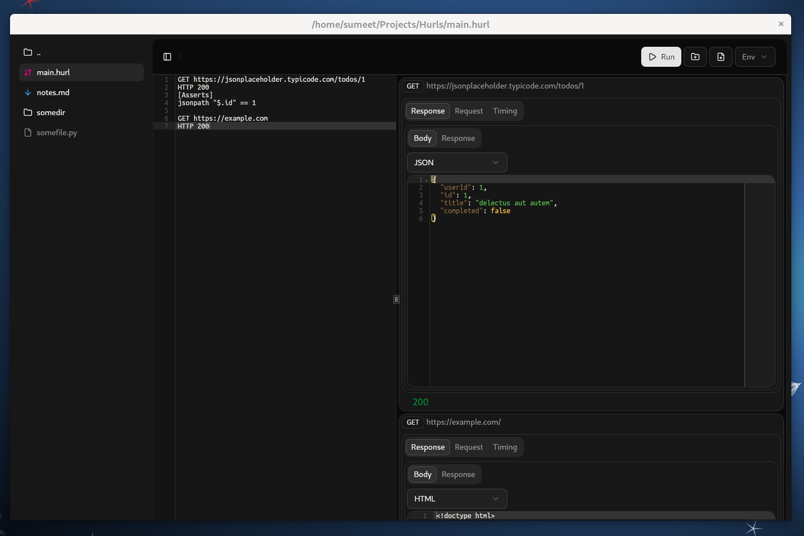

GUI for [Hurl](https://hurl.dev/).
## App Screenshot

## Installation

- First, install [Hurl](https://hurl.dev/docs/installation.html).
- Download [HurlStudio](https://github.com/the-sumeet/hurlstudio/releases) from releases, and use.

## Features

- File based.
- Multiple requests per file.
- Response assertion.
- Env vars support.
- Standard file format. Not coupled with the app. We can use the fiels without the desktop app.

## ToDo

- Convert to SvelteKit.
- Show editor for env var file.
- Save UI preferences like selected env, etc.