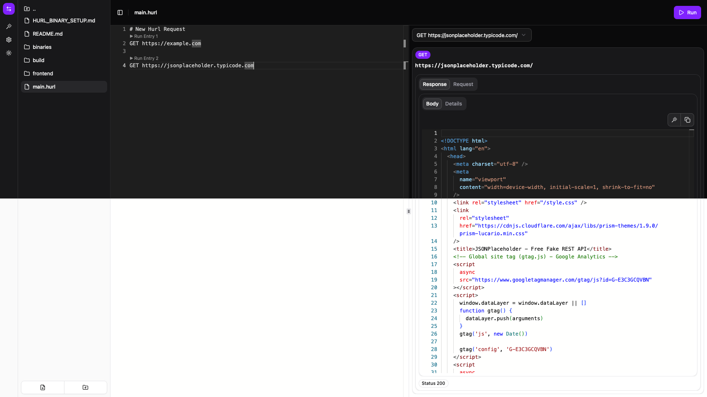

# Hurl Studio

A GUI for [Hurl](https://hurl.dev/) and Markdown files.

# Features

- Run hurl file.
- Store the Hurl file response as json.
- Execute single request from the Hurl file.
- Edit and preview markdown files.